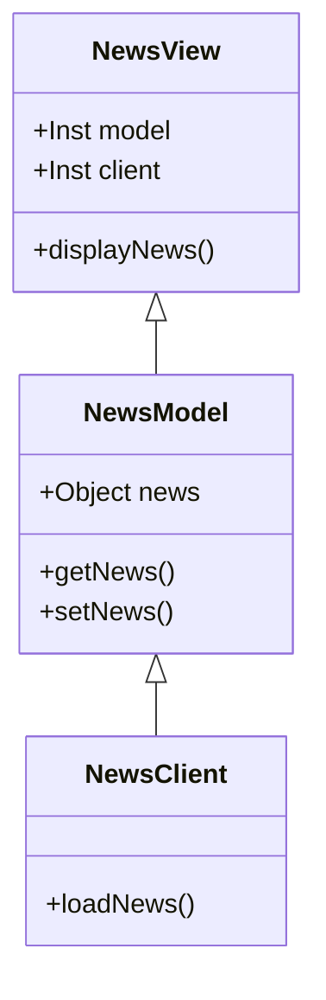

# News Challenge Multi-Class Planned Design Recipe

## 1. Describe the Problem

Your app will grab all the headlines from the Guardian newspaper API and display them on a page.
Clicking on a headline will link the user to the actual article page on the Guardian's website.

### User stories

```
As a busy politician
So I know what the big stories of the day are
I can see all of today's headlines in one place
```

```
As a busy politician
So that I have something nice to look at
I can see a relevant picture to illustrate each news article when I browse headlines
```

```
As a busy politician
So I can get a few more details about an important story
I can click a news article title which links to the original article
```

```
As a busy politician
So I can search what I want to read about
I can specify a search query on the page and get articles matching this search
```

### Stretch user stories

```
As a busy politician
So I can quickly read through the essential of today's stories
I can see a summarised version of of the article 
```

```
As a busy politician
Just in case my laptop breaks
I can read the site comfortably on my phone
```

```
As a busy politician
So I make my news reading more fun
I can see whizzy animations in the app
```

## 2. Design the Class System



```javascript
class NewsModel {
  constructor() {
    this.news = []; // An array of objects
  }
  
  setNews(news) {
    // Receives input from NewsClient and stores it in this.news
  }

  getNews() {
    // Returns this.news
  }
}

class NewsClient {
  loadNews(successCallback, errorCallback) {
    // Retrieves latest news from the API and passes it to the
    // success or error callbacks
  }
}

class NewsView {
  constructor(model, client) {
    this.model = model;
    this.client = client;
  }
  
  displayNews() {
    // Calls NewsClient.loadNews, then displays headlines
    // from NewsModel.getNews
  }
}

```

## 3. Guardian API response data

These are the fields we want to use, in the structure that they'll be retrieved from the API:

```json
{
  "response": {
    "results": [
      {
        "webPublicationDate":"2022-02-02T14:42:43Z",
        "webTitle":"At last, the inventors of modern skiing have something to cheer: Dave Ryding | Andy Bull",
        "webUrl":"https://www.theguardian.com/sport/blog/2022/feb/02/at-last-the-inventors-of-modern-skiing-have-something-to-cheer-dave-ryding",
        "fields": {
          "thumbnail": "https://media.guim.co.uk/1e2ab1ced5da6ecf8d7fcca9f87d5398c1d22336/0_119_6480_3888/500.jpg"
        }
      },
    // ...
    ]
  }
}
```

## 3. Create Examples as Integration Tests


```javascript

```

## 4. Create Examples as Unit Tests

### NewsModel

```javascript
// Retrieves news from the model
const model = new NewsModel();

expect(model.getNews()).toBe({});


// Stores latest news
const model = new NewsModel();
const data = {
  "response": {
    "results": [
      {
        "webPublicationDate":"2022-02-02T14:42:43Z",
        "webTitle":"At last, the inventors of modern skiing have something to cheer: Dave Ryding | Andy Bull",
        "webUrl":"https://www.theguardian.com/sport/blog/2022/feb/02/at-last-the-inventors-of-modern-skiing-have-something-to-cheer-dave-ryding",
        "fields": {
          "thumbnail": "https://media.guim.co.uk/1e2ab1ced5da6ecf8d7fcca9f87d5398c1d22336/0_119_6480_3888/500.jpg"
        }
      }
    ]
  }
}
model.setNews(data);

expect(model.getNews().headline).toBe("At last, the inventors of modern skiing have something to cheer: Dave Ryding | Andy Bull");
```

## 5. Implement the Behaviour

_After each test you write, follow the test-driving process of red, green,
refactor to implement the behaviour._
